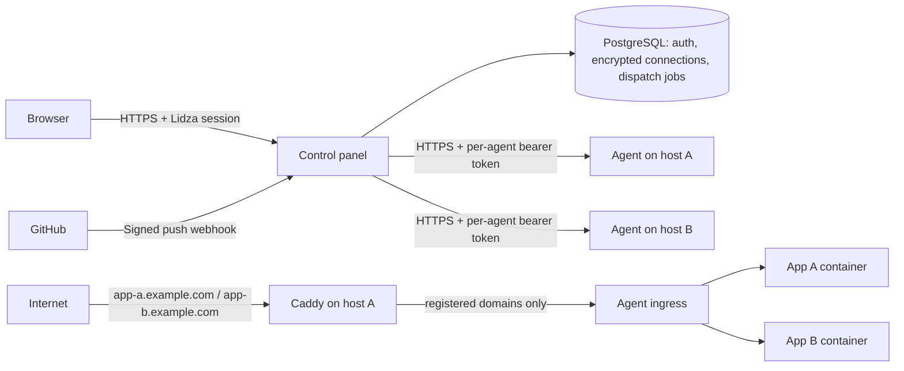

# Deployment runbook

## Topology



Keep the agent API and application ingress on loopback. Expose the management API through an explicit Caddy hostname when the GUI is remote. Use a distinct, random token of at least 32 characters for each agent. The GUI talks to a colocated agent over loopback HTTP; remote agents require HTTPS with certificate verification.

## One-command installation

The repository-root `install.sh` is the primary entry point. It installs the agent and control panel by default:

```sh
sudo sh install.sh --fqdn deploy.example.com
# Or, from the published main branch:
curl -fsSL https://raw.githubusercontent.com/agim/lidza-deploy/main/install.sh | sudo sh -s -- --fqdn deploy.example.com
```

It detects amd64/arm64, uses the local checkout or downloads the selected GitHub source (`--version REF`, default `main`), builds both binaries, then runs the host installer. Go is reused when suitable or downloaded temporarily with pinned official SHA-256 verification. `--fqdn` is mandatory: choose a public hostname or explicit `localhost`. Missing or invalid values stop before installation changes. `--check` and `--plan --fqdn HOST` make no changes; `--stage /absolute/path` builds an inspectable installation tree. Existing installations retain their credentials. Use `--agent-only --fqdn agent.example.com --email ops@example.com` for a separate hosting server.

Manual bundles remain useful when the build machine and hosting server differ:

## Install the host agent

Build a self-contained agent bundle with `./scripts/package-agent.sh amd64` (or `arm64`). Transfer `dist/lidza-agent-linux-<arch>.tar.gz` and its checksum to a dedicated Debian 12/13 or Ubuntu 22.04/24.04 host, verify the archive checksum, and extract it. Run:

```sh
sudo ./install-agent.sh --fqdn agent.example.com --email ops@example.com
```

The installer verifies its bundled files, installs Git, Docker Engine and Caddy through signed apt repositories, creates the service account and private random agent token, installs configuration and systemd units, validates Caddy, and starts/checks the services. No Go toolchain is required on the hosting server. The agent API stays on loopback; the optional explicit hostname exposes only authenticated `/v1/*` over HTTPS. For a colocated GUI, use `--with-control --fqdn deploy.example.com`; its agent API stays on loopback unless a separate `--hostname agent.example.com` is supplied. Use `--fqdn localhost` only when local access is intended. Domain issuance still requires DNS pointing to this host and reachable ports 80/443.

Private connection details for the GUI are in `/etc/lidza-agent/connection.json`. The installer never prints the token. Re-running with the same options preserves it and existing agent configuration. An existing unmanaged Caddy configuration is rejected before package installation; the installer does not replace unrelated sites. `--plan` shows the workflow. `--stage /absolute/path` writes an inspectable installation tree without installing packages or starting services.

This installer targets dedicated systemd hosts. Docker access grants host-level privileges, so only trusted repository owners may deploy. The live apt/systemd installation has not been executed on a disposable supported VM in this cloud workspace; staged installation, repeatability, checksums, permissions, and generated Caddy validation are tested.

## Domains and automatic SSL

Use `deploy/Caddyfile` as the basis of the host configuration. Set `ACME_EMAIL` in Caddy's service environment. Validate it with `caddy validate --config /etc/caddy/Caddyfile --adapter caddyfile` before reloading.

Caddy's catch-all HTTPS listener uses on-demand TLS. Before issuance it calls the loopback-only agent `/tls/allow?domain=...` endpoint. Only exact registered FQDNs are approved. Persist Caddy's normal data directory: it holds certificates, keys, and ACME account state. Caddy renews certificates automatically.

For each application, create DNS A (and AAAA only when IPv6 works) records pointing to the hosting server. Both HTTP and HTTPS must reach Caddy for redirects and ACME validation. Do not publish the agent's port 9090, ingress port 8081, or Docker's dynamic application ports.

For a remote GUI, uncomment and customize the explicit `agent.example.com` block. It exposes only `/v1/*`; never expose `/tls/allow` via a public reverse proxy. Restrict the management hostname to the control-panel host at the firewall where practical. Configure DNS before expecting its certificate.

These settings support multiple apps on the same host, each with its own FQDN/certificate. Wildcards and multiple aliases per app are not implemented in this first version.

## Install the control panel

Install the bundled control panel alongside the agent:

```sh
sudo ./install-agent.sh --with-control --fqdn deploy.example.com
```

The installer installs Docker, Caddy, both services, and a private local-agent pairing. It starts the control panel in first-run mode; no database or OAuth environment edits are required. For a remote hosting agent, install that host separately with `--fqdn agent.example.com`, then import its private connection file in the wizard or Servers page.

Point the GUI hostname's DNS to the server and allow ports 80/443 before installation. Open `https://deploy.example.com` directly; the installer configures Caddy and the allowed setup origin. Unlock it with `/var/lib/lidza-control/setup-token` (read with sudo over SSH or your cloud server console). The key is private, one-time, and never printed by the installer. The wizard creates the operator account, provisions managed PostgreSQL or checks an existing database, confirms the installer-selected address and public HTTPS, saves GitHub OAuth credentials, and pairs an agent. The address cannot be changed during setup or silently changed by reinstalling with a different FQDN.

For explicit `--fqdn localhost`, the GUI has no public Caddy route. Use `http://localhost:3000`, with `ssh -N -L 3000:127.0.0.1:3000 user@control-host` when remote. There is no implicit localhost default. The development/bootstrap API still supports the older network configuration flow when started outside the installer without an explicit origin.

Settings are encrypted through Līdza credentials in the control data directory. Back up that directory (including its master key), PostgreSQL, and agent state securely. Completion is durable before the setup key is removed; restart boots the configured application and never reopens setup. Failed setup can be retried and reuses its managed database.

GitHub can be configured after boot without restarting: [Līdza #26](https://github.com/agim/lidza/issues/26) is fixed in the pinned v0.1.71 release and verified by the onboarding integration test. Real GitHub OAuth and public ACME still require acceptance checks with your own host and credentials.

The existing environment-configured development path remains supported by `scripts/dev-prepare.sh` and `scripts/dev-web.sh`. Process environment overrides take precedence; GUI configuration rejects overridden GitHub keys rather than silently ignoring edits.

Use the Servers page to connect an installed agent, edit its name/URL/token, or remove an unused server. Connection checks the authenticated agent API before saving. Remote URLs require HTTPS; colocated agents may use loopback HTTP. Tokens are encrypted with the framework credential API and never returned to the browser. Leave the token blank when editing to preserve it. Changing an endpoint requires that the target agent already contains the registered apps; this is not a migration workflow. Removing a server does not uninstall its agent and is blocked while apps are registered.

`CONTROL_SERVERS_FILE` is an optional seed using `deploy/servers.example.json`. Keep it owner-readable only. The saved encrypted inventory takes precedence after the first successful metadata save; editing the seed file then has no effect. Single active process only: its deployment inventory is host-local encrypted state, while auth and dispatch use PostgreSQL.

The app creates the pinned framework auth/jobs/mail-outbox tables on first boot under a database advisory lock. Existing operator passwords are not reset on restart. `CONTROL_PASSWORD` may be removed after account creation; use Līdza's authenticated password-change endpoint to rotate it. Back up PostgreSQL, the control data directory, agent state, and the master key through a secure channel. Losing the master key loses access to encrypted grants and state.

Proxy the control panel through a separate Caddy hostname. Block `/metrics`, `/readyz`, and `/healthz` externally; they are local operational endpoints. Other paths, including `/hooks/github/*`, must reach the web app. In particular, webhooks must not be hidden behind additional interactive proxy authentication.

## GitHub authorization and auto-deploy

New installations use **Integrations → Connect GitHub**. Enter an organization name only if the App should belong to that organization; otherwise it belongs to your personal account. Approve the prefilled private GitHub App, return, then choose **Choose repositories** and select its repositories. The owner never copies OAuth credentials or a private key. Local Līdza login remains independent of GitHub. Organizations can require administrator approval.

The control panel verifies installations and stores the App private key in framework-encrypted product state. Its webhook secret uses sealed framework credentials. Short-lived, repository-scoped installation tokens are minted automatically. The agent receives a one-use checkout ticket and obtains a fresh token after its queue/backup wait, before cloning; it never receives the App private key. Upgrade both control panel and agents to use this protocol.

App-owned signed webhooks use `/hooks/github-app`; Auto-deploy chooses which app/branch receives them without creating per-repository hooks. Public repositories can still deploy without connecting GitHub. Use Load repositories when creating an app to choose authorized private repositories.

Existing OAuth connections remain functional. Their callback remains `/api/v1/auth/connect/github/callback`, and existing grants use `repo admin:repo_hook`. Reconnect them from Integrations if needed. **Use GitHub App** verifies access before switching an existing app and its previews. Old per-repository hook deliveries are then ignored; remove those hooks in GitHub. See [Guided GitHub connection](github-app-plan.md) for migration and scope limits.

Only a valid HMAC SHA-256 signature, matching repository, and matching branch can enqueue deployment. Deleted branches and other event types are ignored. Persistent Līdza jobs retry dispatch up to 12 times with backoff when the agent is unavailable. The integration page can disconnect GitHub; disable or delete the repository webhook in GitHub when retiring an app. The agent deduplicates accepted deliveries within its retained 500-deployment history.

A push deploys the latest tip of the configured branch when cloning begins. Multiple pushes queue serially; a queued older event may therefore deploy a newer tip. The resulting commit SHA is recorded. Dispatch completion means the agent accepted the job; watch deployment history for build/readiness results. Failed builds require a fresh deploy after correction. Jobs that exhaust dispatch retries appear in the Push delivery queue; use GitHub redelivery after resolving the error. Agent restart marks interrupted builds as failed rather than persisting GitHub clone credentials.

## Application repository contract

At the repository root, provide:

- An existing `lidza.json` identifying the Līdza app. The framework maintainer confirmed this is required project metadata, not a deployment file that can be inferred.
- The app’s `go.mod` with a published framework version when generating a missing Dockerfile.
- A normal Līdza runtime entrypoint; `/readyz` is already supplied by the framework. No custom readiness handler is required.

A Dockerfile is optional. In the disposable checkout, the agent uses the framework deployment generator to create a missing Dockerfile, `.dockerignore`, and service template. It pins the generated CLI/toolchain to the app’s `go.mod`, preserves custom files, rejects local module replacements during automatic generation, and uses the framework’s secret exclusions. Nothing is committed or pushed to the source repository. [Framework issue #25](https://github.com/agim/lidza/issues/25) declined missing-manifest inference; the agent reports a missing project manifest rather than inventing one. Pin published framework versions and image versions/digests; avoid local `replace` dependencies. Apps with Rust packs need the corresponding build tools in their Dockerfile. The agent does not inject a GitHub clone token into the Docker build: private package/module dependencies need a separate explicitly designed build-secret workflow and are not supported yet.

Runtime containers use UID/GID 65532, a read-only root, a temporary `/tmp`, no extra capabilities, 512 MiB memory, one CPU, and 256 processes. Apps can select local or external PostgreSQL in the GUI and use external Valkey/object storage as needed; per-app persistent volumes and adjustable resource limits are not exposed yet. Runtime variables are passed in a private temporary env file and removed after startup. The agent overrides listener/mode and rejects app-level LIDZA TLS settings because Caddy terminates HTTPS.

The old release remains live during clone, build, and readiness checking. The candidate has up to 90 seconds to become ready, within a 20-minute build/reload deadline; pre-deployment backups and activation together have a two-hour limit. Once routing state is persisted, new requests use the candidate. The previous container remains available for rollback; the older retained container/image is removed after the next successful deploy. Both retained app containers keep running, so background workers can overlap; design migrations/jobs accordingly. Rollback changes application routing, not database state. Build cache cleanup and orphaned containers after a hard host crash remain operator maintenance tasks; do not run global Docker pruning without reviewing other workloads.


### Editing applications

Use an application's Settings button to change its branch, FQDN, or runtime environment. Domain routing changes immediately; point DNS at the host first. Caddy allows the newly registered domain and obtains its certificate on demand. Saving settings on a deployed app queues a readiness-checked reload of the existing image with its new environment. No GitHub fetch or rebuild is needed. Branch changes select the source for the next Git deployment. Active deployments or reloads block edits. APP_URL defaults to https:// plus the saved FQDN unless explicitly supplied in the environment. Repository and server assignments are fixed in this version.

Environment settings show names with masked, write-only value fields. Use Add variable to supply a name and value; use Replace value to rotate a secret or Delete variable to remove it. Keep saved value preserves existing values without sending them to the browser. Advanced JSON import remains available: strings set keys, `null` deletes keys, omitted keys are preserved. Close/save clears entered values; the browser does not retain them in local storage.

Agent state, including all per-app variables, is encrypted using Līdza's authenticated credential encryption and atomically saved with mode 0600. Existing plaintext private state migrates automatically at startup. Back up the agent's `config/master.key` together with encrypted state (or the securely supplied `LIDZA_MASTER_KEY` when used). Losing the key prevents reopening state. HTTPS is required to reach remote agents. Variables are isolated per app, passed only to runtime containers through a temporary mode-0600 file, and excluded from the image build. Docker administrators and the hosted application can access their runtime environment; applications must avoid printing secrets in their own logs.

Saving applies runtime changes through an automatic reload. Follow the queued result in Deployments; a failed candidate leaves the current healthy container serving. Use Reload to retry after correcting a failure. An app that has never been deployed still needs its first Deploy. A running or rollback release keeps the environment with which it started; rotating a compromised secret also requires retiring old releases/credentials as appropriate.

Control metadata and remote agent settings cannot be committed atomically. If an agent saves settings but the control-panel disk write fails, the API reports that explicitly; retry the same settings after restoring writable storage to synchronize them.

Disable auto-deploy from the application card. This persists locally even when GitHub is disconnected. The GitHub webhook remains installed and signed deliveries are acknowledged without queuing work. Pending dispatch jobs skip disabled applications; deployments already accepted by the agent can finish. Re-enabling synchronizes the existing webhook and requires GitHub authorization.


### Retiring an application

Choose Remove and type the application ID. This disables auto-deploy before contacting the agent. Active deployments must finish before removal; retry afterward. Once agent cleanup begins, the FQDN stops routing and is no longer authorized for certificates. Both retained containers and their images are removed, then the app configuration and environment are deleted. Both local and external databases and backup files are preserved, unattached databases stop their scheduled backups, and database IDs remain reserved on that agent. Databases shared with another active app keep their schedules. DNS records and existing Caddy certificate files are untouched. See [database recovery and retention](databases-backups.md).

If the agent is unavailable or Docker cleanup fails, the application remains marked “removal pending.” Retry removal to finish; do not delete its server record or state files to bypass cleanup. Pending webhook jobs are ignored, including old jobs after an ID is reused. Remove the now-unused GitHub webhook manually; app removal does not require a working OAuth connection. Retained deployment history remains available within the agent’s history limit.

The live workspace opens directly at the root and uses the approved Līdza-branded Signal design. If one server is unavailable, deployment history from healthy servers remains visible with an explicit warning naming unavailable servers.

Application database provisioning, local/S3 backup policies and SMTP alert setup are documented in [Databases and backups](databases-backups.md). Līdza v0.1.71 resolves [#27](https://github.com/agim/lidza/issues/27); concurrent mail reload and queued-delivery regressions pass. Upgrade both the control panel and hosting agents to use the database APIs.
